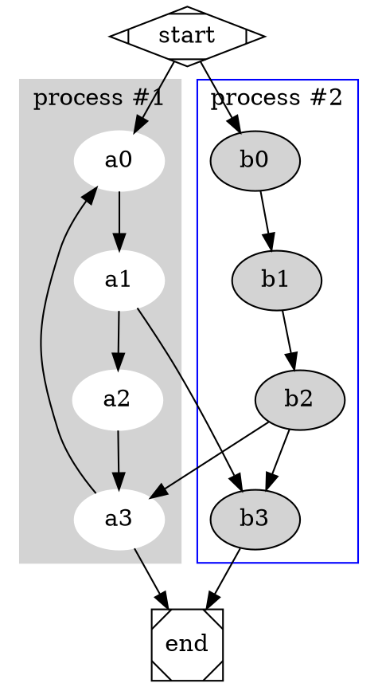

# This is a chapter written with Markdown

The justifications for using Markdown over \LaTeX\ are many, but the most obvious one is likely the clearer syntax.
Overleaf supports Markdown through the `markdown`-package. [@markdown-latex], [@markdown-overleaf]
This document is a small overview of the possibilities, but is in no way exhaustive of the topic.

The idea is that Markdown just lets you write and not have to think about typesetting your document.
Additionally, it is very easy to read Markdown-files without needing to compile the document first.
This is in sharp contrast to \LaTeX\ which is a much more powerful system, but also much more complex.

## Equations and other \LaTeX

Equations are written like normally in \LaTeX\ with dollarsigns; `$\frac{5}{4}$` becomes $\frac{5}{4}$.
You can also write equations in display-mode with double dollarsigns like usual:

    $$
    \frac{6}{9}
    $$

becomes

$$
\frac{6}{9}.
$$

Standard environments like `align` and `equation` are also supported.

    \begin{align}
        \int_1^\infty\frac{1}{x^2}\,dx = 1 \label{eq:integral}
    \end{align}

becomes

\begin{align}
    \int_1^\infty\frac{1}{x^2}\,dx = 1 \label{eq:integral}.
\end{align}

You also have access to most, if not all other \LaTeX\ macros and or code.

\clearpage
## Diagrams using the DOT language

Fenced code blocks with `dot` as the language are treated differently to normal code blocks.

    See figure \ref{fig:test}
    
    \setkeys{Gin}{width=.5\textwidth}
    ```dot \label{fig:test}A graph
    digraph G {
    
      subgraph cluster_0 {
        style=filled;
        color=lightgrey;
        node [style=filled,color=white];
        a0 -> a1 -> a2 -> a3;
        label = "process #1";
      }
    
      subgraph cluster_1 {
        node [style=filled];
        b0 -> b1 -> b2 -> b3;
        label = "process #2";
        color=blue
      }
      start -> a0;
      start -> b0;
      a1 -> b3;
      b2 -> a3;
      a3 -> a0;
      a3 -> end;
      b3 -> end;
    
      start [shape=Mdiamond];
      end [shape=Msquare];
    }
    ```

See figure \ref{fig:test}

\setkeys{Gin}{width=.5\textwidth}


## Code blocks

Code blocks are written between pairs of three (or more) backtics.

    ```language, alternative={text}
    { code here }
    ```

On the same line as the three first backtics you should first write the name of the language, then other options from the `listings` package can be added.
In the below example, a caption and a label are given.
It is important that this line be formatted correctly.
The first item in the list *must* be the language and you are not allowed to split the line.

    ```c++, caption={c++}, label={code:direct}
    #include <iostream>
        
    int main(int argc, char argv[]) {
        std::cout << "Hello, World!" << std::endl;
        return 0;
    }
    ```
    
This example produces the code seen in listing \ref{code:direct}.

```c++, caption={c++}, label={code:direct}
#include <iostream>

int main(int argc, char argv[]) {
    std::cout << "Hello, World!" << std::endl;
    return 0;
}
```

### Code from a different file

It is possible to include code directly from a file with the help of the option `contentBlocks` when including the `markdown` package.
It is then quite easy to include code files.

    /filename (language, alternative={text})
    
E.g.:

    /testcode.c (C, caption={File})

which includes code listing \ref{code:included}.

/testcode.c (C, caption={File}, label={code:included})

## Cross-referencing

Use `\label{name}` as usual to assign a handle.
Reference it with `\ref{name}`.

    See equation \ref{eq:integral}

See equation \ref{eq:integral}.

## Citations

Cite a handle with

    @handle
    
E.g:

    See Calculus @AdaEss2017.

becomes:

See Calculus @AdaEss2017.

If you don't want to include the author(s)

    See Calculus [@AdaEss2017].
    
See Calculus [@AdaEss2017].

Referencing specific pages:

    See Calculus [@AdaEss2017, p. 123 and 130].
    
See Calculus [@AdaEss2017, p. 123 and 130].

## Verbatim

Verbatim blocks can be created by indenting the text with 4 spaces.
I've used this method to write all the examples that would otherwise have been interpreted in a different way.

    Verbatim text doesn't get interpreted in any
    special way before being included in the document.

## Figures

    \setkeys{Gin}{width=.7\textwidth}
    

Gives figure \ref{fig:diagram}.
The first line is to set the width of the image before it's included.
This is a small hack around the syntax, which doesn't allow to pass more parameters.

\setkeys{Gin}{width=.7\textwidth}
")

Refer to the figure using `\ref{fig:diagram}`.
Note `fig:` before `diagram`.
    
## Lists

Lists in Markdown are superbly simple.

1. This
1. Is
1. A
1. Numbered
    1. And
        1. Nested
    1. List


- This
- Is
- An
- Un-numbered
    - And
        - Nested
    - List

1. You
    - Can
    - Also
    - Mix
1. The list-types

## Tables

Tables are likely best handled in the same way as including code from other files:

    /testtable.csv (\label{tab:ex} A test table.)

gives you table \ref{tab:ex}.

/testtable.csv (\label{tab:ex} A test table.)

I think pipe tables should work, but I may have broken a setting.

## Quotes

    > "Markdown supports quotes like this."
    >
    > -- Bob Core

> "Markdown supports quotes like this."
>
> -- Bob Core

## Bold, italics, and verbatim inline

You can write *italic* or **bold** text by wrapping it in one or two asterisks respectively on each side.
You can also write inline `verbatim` by wrapping it in backticks.

Usually Markdown will support underscore as an alternative to asterisk for bold and italic text.
I have disabled this in favour of being able to use underscores in \LaTeX\ equations.

\clearpage

## Footnotes

    See the footnote for more info.[^myfootnote]

See the footnote for more info.[^myfootnote]

    [^myfootnote]: Footnotes have a simple and usable syntax.

[^myfootnote]: Footnotes have a simple and usable syntax.

# More

For more possibilities, see *Markdown Package User Manual* [@markdown-latex] and *How to write in Markdown on Overleaf*. [@markdown-overleaf]